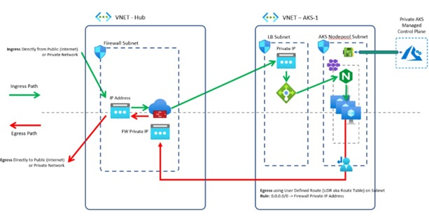
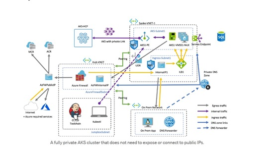
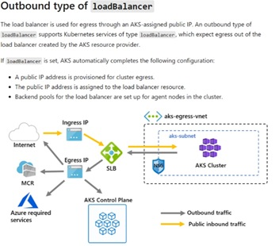

# Terraform-Azurerm-Overlays-Kubernetes

   

## Overview

This overlay module deploys a Azure Kubernetes Service - Private Cluster - Kubenet suitable for hosting docker container apps. The cluster will be deployed to the Hub/Spoke shared services resource group or a Tier 3 spoke using default naming unless alternative values are provided at run time.

Read on to understand what this example does, and when you're ready, collect all of the pre-requisites, then deploy the example.
## SCCA Compliance

This overlay module will deploy a SCCA compliant, Private AKS Cluster. This is accomplished by isolating the control plane from the user plane. Egress is controlled by creating a UserDefinedRoute that directs all tracffic through an Azure the Azure Firewall in the HUB network. Ingress in controlled by directing all inbound traffic through a Azure Loadbalancer. The Private AKS Cluster is also configured with private endpoints along with SCCA compliant network rules.

Ref: Azure NoOps Hub Module [SCCA compliant Network](https://registry.terraform.io/modules/azurenoops/overlays-hubspoke/azurerm/latest).
For more information, please read the [SCCA documentation](). 

## Deploy Azure Kubernetes Service - Private Cluster - Kubenet

Documentation for the Azure Kubernetes Service (AKS): <https://learn.microsoft.com/en-us/azure/aks/>.  By default, this overlay will deploy resources into standard default hub/spoke subscriptions and resource groups.  

Documentation for AKS Custom egress: <https://learn.microsoft.com/en-us/azure/aks/egress-udr/>

The subscription and resource group can be changed by providing the resource group name and ensuring that the Azure context is set to the proper subscription.  

## Pre-requisites

* A virtual network and subnet is deployed. 
* Decide if the optional parameters is appropriate for your deployment. If it needs to change, override one of the optional parameters.

### AKS Service Principal

To access other Azure Active Directory (Azure AD) resources, an AKS cluster requires either an Azure Active Directory (AD) service principal or a managed identity. A service principal or managed identity is needed to dynamically create and manage other Azure resources such as an Azure load balancer or container registry (ACR).

> NOTE: The overlay use the userAssignedIdentities parameter by default for the managed identity.

## Parameters

See below for information on how to use the appropriate deployment parameters for use with this overlay:

Required Parameters | Type | Allowed Values | Description
| :-- | :-- | :-- | :-- |
parRequired | object | {object} | Required values used with all resources.
parTags | object | {object} | Required tags values used with all resources.
parLocation | string | `[deployment().location]` | The region to deploy resources into. It defaults to the deployment location.
parKubernetesCluster | object | {object} | The object parameters of the Azure Kubernetes Cluster.
parTargetSubscriptionId | string | `xxxxxx-xxxx-xxxx-xxxxx-xxxxxx` | The target subscription ID for the target Network and resources. It defaults to the deployment subscription.
parTargetResourceGroup | string | `anoa-eastus-platforms-hub-rg` | The name of the resource group in which the Azure Kubernetes Cluster will be deployed. If unchanged or not specified, the NoOps Accelerator will create an resource group to be used.
parTargetVNetName | string | `anoa-eastus-platforms-hub-vnet` | The name of the VNet in which the aks will be deployed. If unchanged or not specified, the NoOps Accelerator shared services resource group is used.
parTargetSubnetName | string | `anoa-eastus-platforms-hub-snet` | The name of the Subnet in which the aks will be deployed. If unchanged or not specified, the NoOps Accelerator shared services resource group is used.

### parKubernetesCluster Parameters

Parameters | Type | Allowed Values | Description
| :-- | :-- | :-- | :-- |
name | string | {Contoso} | Specifies the name of the AKS cluster.
enableSystemAssignedIdentity | bool | {false} | Enables system assigned managed identity on the resource.
aksClusterKubernetesVersion | string | {1.24.3} | Required values used with all resources.
enableRBAC | bool | {true} | Whether to enable Kubernetes Role-Based Access Control.
enableResourceLock | bool | {false} | Required values used with all resources.
enablePodIdentity | bool | {false} | Whether the pod identity addon is enabled.
aksClusterSkuTier | string | {Free} | Required values used with all resources.
usePrivateDNSZone | bool | {true} | If AKS will create a Private DNS Zone in the Node Resource Group.
enableIngressApplicationGateway | bool | {false} | Specifies whether the ingressApplicationGateway (AGIC) add-on is enabled or not.

`primaryAgentPoolProfile` Parameters | Type | Allowed Values | Description
| :-- | :-- | :-- | :-- |
name | string | {systempool} | Specifies the name of the AKS AgentPool.
vmSize | string | {Standard_DS2_v2} | Specifies the name of the AKS AgentPool vmSize.
osDiskSizeGB | int | {30} | Specifies the name of the AKS AgentPool VM OS Disk Size in GB.
osDiskType | string | {Managed} | Specifies the name of the AKS AgentPool VM OS Disk type.
enableAutoScaling | bool | {true} | Enables auto scaling on the agent pool.
count | int | {10} | Specifies the name of the AKS AgentPool count.
osType | string | {Linux} |Specifies the name of the AKS AgentPool VM OS type
osSKU | string | {Ubuntu} | Specifies the name of the AKS AgentPool VM OS Sku.
type | string | {VirtualMachineScaleSets} | Specifies the name of the AKS AgentPool VM type.
mode | string | {System} | Specifies the name of the AKS AgentPool mode.
availabilityZones | string | {string} | Specifies the name of the AKS AgentPool availability Zones.

`networkProfile` Parameters | Type | Allowed Values | Description
| :-- | :-- | :-- | :-- |
aksClusterLoadBalancerSku | string | {standard} | Specifies the sku of the load balancer used by the virtual machine scale sets used by nodepools.
aksClusterPodCidr | string | {10.244.0.0/16} | Specifies the CIDR notation IP range from which to assign pod IPs when kubenet is used.
aksClusterServiceCidr | string | {172.16.1.0/24} | A CIDR notation IP range from which to assign service cluster IPs. It must not overlap with any Subnet IP ranges.
aksClusterDnsServiceIP | string | {172.16.1.10} | Specifies the IP address assigned to the Kubernetes DNS service. It must be within the Kubernetes service address range specified in serviceCidr.
aksClusterDockerBridgeCidr | string | {170.10.0.1/30} | Specifies the CIDR notation IP range assigned to the Docker bridge network. It must not overlap with any Subnet IP ranges or the Kubernetes service address range.
aksClusterOutboundType | string | {userDefinedRouting} |Specifies outbound (egress) routing method. - loadBalancer or userDefinedRouting.

`apiServerAccessProfile` Parameters | Type | Allowed Values | Description
| :-- | :-- | :-- | :-- |
enablePrivateCluster | bool | {true} | Specifies whether to create the cluster as a private cluster or not. Default: True
enablePrivateClusterPublicFQDN | bool | {false} | Whether to create additional public FQDN for private cluster or not. Default: False

`aadProfile` Parameters | Type | Allowed Values | Description
| :-- | :-- | :-- | :-- |
aadProfileTenantId | string | {TenantId} | Specifies the tenant ID of the Azure Active Directory used by the AKS cluster for authentication.
aadProfileAdminGroupObjectIDs | array | [ "GroupObjectID"] | Specifies the AAD group object IDs that will have admin role of the cluster.

`addonProfiles` Parameters | Type | Allowed Values | Description
| :-- | :-- | :-- | :-- |
omsagent | object | {"enable": true,"config": {"logAnalyticsWorkspaceResourceID": "/subscriptions/subscriptionId/resourcegroups/anoa-eastus-dev-logging-rg/providers/microsoft.operationalinsights/workspaces/anoa-eastus-dev-logging-log"} | Specifies whether the OMS agent is enabled.

`servicePrincipalProfile` Parameters | Type | Allowed Values | Description
| :-- | :-- | :-- | :-- |
clientId | string | {string} | The client AAD application ID.
secret | string | {string} | The server AAD application secret.

## Deploy the Overlay

Connect to the appropriate Azure Environment and set appropriate context, see getting started with Azure PowerShell for help if needed.  The commands below assume you are deploying in Azure Commercial and show the entire process from deploying Hub/Spoke and then adding an Azure Kubernetes Service - Cluster post-deployment.

> NOTE: Since you can deploy this overlay post-deployment, you can also build this overlay within other deployment models such as Platforms & Workloads.

Once you have the hub/spoke output values, you can pass those in as parameters to this deployment.

> IMPORTANT: Please make sure that supperted versions are in the region that you are deploying to. Use `az aks get-verions` to understand what aks versions are supported per region.

For example, deploying using the `az deployment group create` command in the Azure CLI:

## Hub / Workload Spoke Architecture
 
## Fully Private AKS Cluster Using Private Endpoint
 
## Outbound Type LoadBalancer
 
 

## About Azure Container Registry

Documention on Azure Container Registry: <https://learn.microsoft.com/en-us/azure/container-registry/>. By default, this workload uses the Azure Container Registry workload to deploy resources into the AKS workload spoke. 

## About Azure Kubernetes Service - Private Cluster

The Documention on Azure Kubernetes Service: <https://learn.microsoft.com/en-us/azure/aks/>.  this workload uses the Azure Kubernetes Service - Cluster workload to deploy resources into the AKS workload spoke.

<!-- BEGIN_TF_DOCS -->
<!--Run TF Docs-->
<!-- END_TF_DOCS -->